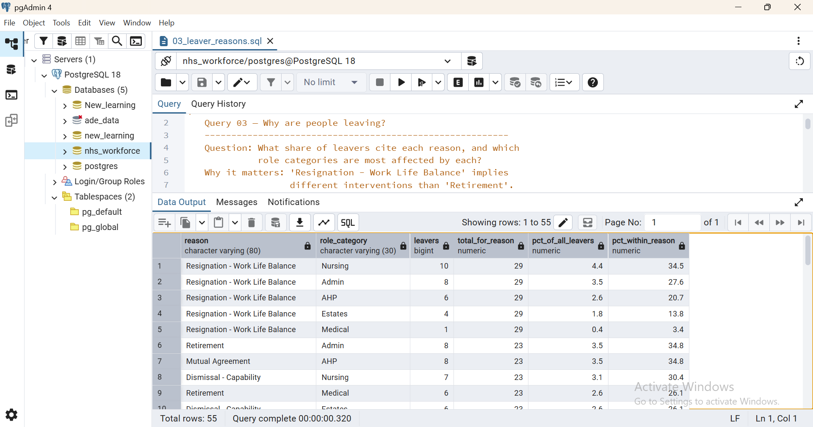
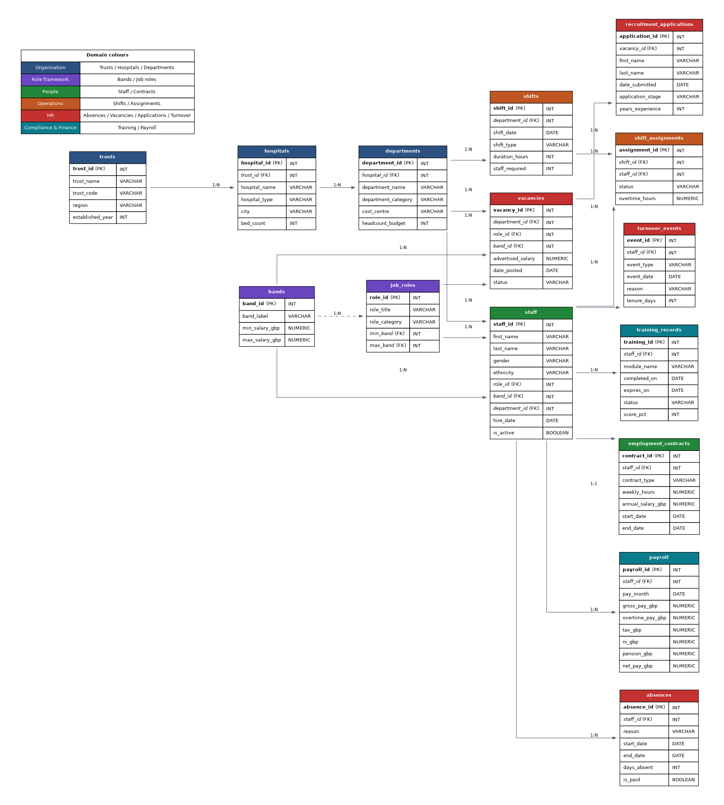

# NHS Workforce Retention Analysis

**An SQL portfolio project investigating staff turnover, absence patterns, and the financial cost of churn across a simulated NHS Trust network.**

---

## The business question

> **Which roles, departments, and trusts are losing staff fastest — and what is it costing the organisation?**

NHS workforce retention is one of the most pressing operational challenges in UK healthcare. Vacancies in nursing and Allied Health Professional (AHP) roles regularly exceed 10% of established posts, and the cost of replacing a single qualified clinician has been estimated by the King's Fund at over £30,000 once recruitment, onboarding, and lost productivity are accounted for. This project uses SQL to dissect a realistic NHS workforce dataset and surface the levers a workforce planning team could pull to reduce attrition.

---

## Headline findings

| Metric | Value |
| --- | --- |
| Active staff | **2,758** |
| Leavers in last 12 months | **146** |
| Annual turnover rate | **5.3%** |
| Top leaver reason | Resignation — Work-Life Balance |
| Highest-attrition role category | AHP (55 leavers) |
| Top department for leavers | Patient Records (21 leavers) |
| Estimated replacement cost (12mo) | **£1.56 million** |
| Mandatory training compliance | **60.0%** (below NHS 85% target) |

---

## Sample query outputs

**Executive summary — one query, the full workforce position:**

**Department cost of churn — where the money is leaking:**

**Monthly leavers trend with running total and rolling average:**

**Turnover by role category and pay band:**

**Leaver reasons by role category:**

---

## Dataset

The schema models a small NHS-flavoured Trust network: 10 NHS Trusts → 30 hospital sites → 150 departments → 3,000 staff, with full HR operational data layered on top.

**15 tables, ~53,000 rows** covering organisational hierarchy, role framework (NHS Agenda for Change bands), people, shifts, absences, vacancies, recruitment, training, payroll, and turnover events.

The data is **synthetic but realistic** — NHS Agenda for Change pay bands use actual 2024 salary ranges; role categories follow NHS Digital workforce taxonomy; turnover, absence, and contract ratios are calibrated against published NHS statistics. No real patient or staff data was used.

---

## SQL features demonstrated

The 10 queries (`01_kpi_overview.sql` through `10_executive_summary.sql`) progressively demonstrate:

- Multi-table JOINs (INNER, LEFT, SELF)
- Common Table Expressions (CTEs) including multi-CTE structures
- Window functions: `ROW_NUMBER`, `DENSE_RANK`, `LAG`, `SUM OVER`, rolling averages
- Filtered aggregates (`COUNT(*) FILTER (WHERE ...)`)
- Conditional aggregation with `CASE WHEN`
- Date arithmetic and `DATE_TRUNC` for time-series grouping
- Cost modelling and rate calculations with safe NULL handling

---

## How to reproduce

1. Install PostgreSQL 15+ and pgAdmin 4.
2. Create a database called `nhs_workforce`.
3. Open `nhs_workforce.sql` in pgAdmin's Query Tool and press F5 to load the schema and data.
4. Open any of the 10 numbered `.sql` query files and run.

---

## Author

**Sodiq** — Data analyst portfolio project, May 2026.
